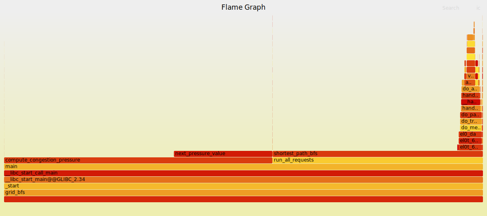
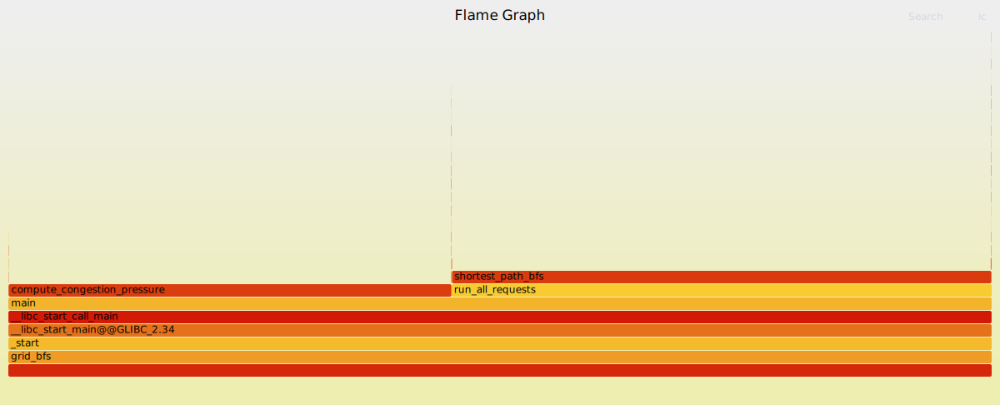

# Intro Profiling Lab Report

## 1. Optimizations Made

- row-major access - in compute_congestion_pressure, changed column-major access to more cache-friendly row-major access to reduce L1 cache misses
- fixed memory leak in shortest_path_bfs - replaced distances, visited and frontier from manually heap allocated(via new[]) and delete-forgotten arrays to RAII compliant objects(std::vector first, then std::array in a later optimisation)
- reduced allocations in shortest_path_bfs - distances, visited and frontier were pulled out of the function body to be global variables instead, to reduce heap allocations happening every time the function is called(1200 times)
- switched if/else in next_pressure_value to ternary - enables compiler to use a cmov(conditional move instruction) instead of branching, allowing it to inline the function since it becomes less complex
- replaced /8 with >>3 in two places and /2 with >> 1 in one place - the variables' values were unsigned ints(>= 0) anyway, so this is more efficient and might promote the compiler to auto vectorise
- used \_\_restrict__ across a call boundary in compute_congestion_pressure - in order to convince the compiler that the arrays don't overlap, so that it autovectorises(failure! - the compiler refuses to autovectorise on -O2)

Stuck to -O2 for measuring the effects of my optimisations, instead of the obviously superior optimisations made by the compiler on -O3.

## 2. Methodology Walkthrough
### Before:
time:
```
real    0m1.602s
user    0m1.498s
sys     0m0.103s
```

perf stat:
```
Performance counter stats for './grid_bfs':

        4367742849      cycles                                                                  (37.50%)
       15657161270      instructions                     #    3.58  insn per cycle              (37.48%)
        1948610059      branches                                                                (37.50%)
          85143560      branch-misses                    #    4.37% of all branches             (25.00%)
        4442827234      cache-references                                                        (25.00%)
         592988479      cache-misses                     #   13.35% of all cache refs           (25.00%)
        4441368776      L1-dcache-loads                                                         (25.01%)
         588004951      L1-dcache-load-misses            #   13.24% of all L1-dcache accesses   (25.00%)

       1.649327849 seconds time elapsed

       1.546996000 seconds user
       0.101999000 seconds sys
```

flamegraph:


callgrind annotation(relevant part for analysis):
```
--------------------------------------------------------------------------------
Ir                   Dr                  Dw                  I1mr           D1mr               D1mw               ILmr           DLmr             DLmw             
--------------------------------------------------------------------------------
180,278,179 (100.0%) 36,584,159 (100.0%) 11,136,774 (100.0%) 2,707 (100.0%) 7,452,210 (100.0%) 2,759,058 (100.0%) 2,178 (100.0%) 398,136 (100.0%) 627,984 (100.0%)  PROGRAM TOTALS

--------------------------------------------------------------------------------
Ir                  Dr                  Dw                 I1mr        D1mr               D1mw               ILmr        DLmr             DLmw              file:function
--------------------------------------------------------------------------------
67,686,834 (37.55%) 15,119,830 (41.33%) 3,293,860 (29.58%)  6 ( 0.22%) 2,869,497 (38.51%)   258,839 ( 9.38%)  6 ( 0.28%)  96,680 (24.28%) 140,462 (22.37%)  /home/user/bootcamp2026-codinglabs/assignment4-profiling/lab1/grid_bfs.cpp:shortest_path_bfs(std::vector<std::__cxx11::basic_string<char, std::char_traits<char>, std::allocator<char> >, std::allocator<std::__cxx11::basic_string<char, std::char_traits<char>, std::allocator<char> > > > const&, RouteRequest const&, std::vector<int, std::allocator<int> >&)'2 [/home/user/bootcamp2026-codinglabs/assignment4-profiling/lab1/grid_bfs]
52,988,657 (29.39%)  2,130,047 ( 5.82%)         .           .                  .                  .           .                .                .           /home/user/bootcamp2026-codinglabs/assignment4-profiling/lab1/grid_bfs.cpp:next_pressure_value(int, int, int, int, int, int, int, int, int)'2 [/home/user/bootcamp2026-codinglabs/assignment4-profiling/lab1/grid_bfs]
30,555,510 (16.95%) 12,848,041 (35.12%) 4,260,226 (38.25%)  4 ( 0.15%) 4,545,006 (60.99%) 2,130,050 (77.20%)  4 ( 0.18%) 273,601 (68.72%) 134,371 (21.40%)  /home/user/bootcamp2026-codinglabs/assignment4-profiling/lab1/grid_bfs.cpp:compute_congestion_pressure(std::vector<int, std::allocator<int> > const&, int, int, int)'2 [/home/user/bootcamp2026-codinglabs/assignment4-profiling/lab1/grid_bfs]
 7,369,262 ( 4.09%)  1,757,710 ( 4.80%) 1,757,643 (15.78%) 12 ( 0.44%)     4,339 ( 0.06%)   215,527 ( 7.81%) 12 ( 0.55%)   4,314 ( 1.08%) 215,293 (34.28%)  /usr/include/c++/14/bits/stl_algobase.h:operator new(unsigned long)'2
 4,594,330 ( 2.55%)         73 ( 0.00%)        72 ( 0.00%)  0                 25 ( 0.00%)         0           0               25 ( 0.01%)       .           /usr/include/c++/14/bits/stl_vector.h:shortest_path_bfs(std::vector<std::__cxx11::basic_string<char, std::char_traits<char>, std::allocator<char> >, std::allocator<std::__cxx11::basic_string<char, std::char_traits<char>, std::allocator<char> > > > const&, RouteRequest const&, std::vector<int, std::allocator<int> >&)'2
 4,260,094 ( 2.36%)          .                  .           .                  .                  .           .                .                .           /usr/include/c++/14/bits/stl_algobase.h:next_pressure_value(int, int, int, int, int, int, int, int, int)'2
 2,618,076 ( 1.45%)  2,618,028 ( 7.16%)         0           0                 24 ( 0.00%)         0           0               24 ( 0.01%)       .           /usr/include/c++/14/bits/basic_string.h:shortest_path_bfs(std::vector<std::__cxx11::basic_string<char, std::char_traits<char>, std::allocator<char> >, std::allocator<std::__cxx11::basic_string<char, std::char_traits<char>, std::allocator<char> > > > const&, RouteRequest const&, std::vector<int, std::allocator<int> >&)'2
 1,842,152 ( 1.02%)    397,714 ( 1.09%)   132,896 ( 1.19%)  2 ( 0.07%)       108 ( 0.00%)     1,077 ( 0.04%)  2 ( 0.09%)       .                .           /home/user/bootcamp2026-codinglabs/assignment4-profiling/lab1/grid_bfs.cpp:generate_grid[abi:cxx11](int, int)'2 [/home/user/bootcamp2026-codinglabs/assignment4-profiling/lab1/grid_bfs]
 1,553,383 ( 0.86%)    337,673 ( 0.92%)   270,291 ( 2.43%)  3 ( 0.11%)         0                  0           3 ( 0.14%)       .                .           /usr/include/c++/14/bits/random.tcc:std::mersenne_twister_engine<unsigned long, 32ul, 624ul, 397ul, 31ul, 2567483615ul, 11ul, 4294967295ul, 7ul, 2636928640ul, 15ul, 4022730752ul, 18ul, 1812433253ul>::operator()() [/home/user/bootcamp2026-codinglabs/assignment4-profiling/lab1/grid_bfs]
 1,490,694 ( 0.83%)    404,946 ( 1.11%)   406,326 ( 3.65%)  .                  .                  .           .                .                .           /usr/include/c++/14/bits/uniform_int_dist.h:int std::uniform_int_distribution<int>::operator()<std::mersenne_twister_engine<unsigned long, 32ul, 624ul, 397ul, 31ul, 2567483615ul, 11ul, 4294967295ul, 7ul, 2636928640ul, 15ul, 4022730752ul, 18ul, 1812433253ul> >(std::mersenne_twister_engine<unsigned long, 32ul, 624ul, 397ul, 31ul, 2567483615ul, 11ul, 4294967295ul, 7ul, 2636928640ul, 15ul, 4022730752ul, 18ul, 1812433253ul>&, std::uniform_int_distribution<int>::param_type const&) [clone .isra.0]'2 [/home/user/bootcamp2026-codinglabs/assignment4-profiling/lab1/grid_bfs]
 1,253,047 ( 0.70%)    135,204 ( 0.37%)    67,611 ( 0.61%)  7 ( 0.26%)     4,227 ( 0.06%)         2 ( 0.00%)  7 ( 0.32%)   3,853 ( 0.97%)       2 ( 0.00%)  /home/user/bootcamp2026-codinglabs/assignment4-profiling/lab1/grid_bfs.cpp:summarize_heatmap(std::vector<int, std::allocator<int> > const&, int, int) [/home/user/bootcamp2026-codinglabs/assignment4-profiling/lab1/grid_bfs]
   860,555 ( 0.48%)    136,359 ( 0.37%)    68,125 ( 0.61%)  2 ( 0.07%)         0                  0           2 ( 0.09%)       .                .           /usr/include/c++/14/bits/random.tcc:std::mersenne_twister_engine<unsigned long, 32ul, 624ul, 397ul, 31ul, 2567483615ul, 11ul, 4294967295ul, 7ul, 2636928640ul, 15ul, 4022730752ul, 18ul, 1812433253ul>::_M_gen_rand() [/home/user/bootcamp2026-codinglabs/assignment4-profiling/lab1/grid_bfs]
   563,082 ( 0.31%)          0            562,320 ( 5.05%)  6 ( 0.22%)         0            140,512 ( 5.09%)  5 ( 0.23%)       0          126,085 (20.08%)  ./string/../sysdeps/aarch64/nptl/../memset.S:__GI_memset [/usr/lib/aarch64-linux-gnu/libc.so.6]
   339,560 ( 0.19%)     67,600 ( 0.18%)         0           1 ( 0.04%)     1,106 ( 0.01%)         0           1 ( 0.05%)   1,106 ( 0.28%)       .           /usr/include/c++/14/bits/stl_algobase.h:print_summary(std::vector<std::__cxx11::basic_string<char, std::char_traits<char>, std::allocator<char> >, std::allocator<std::__cxx11::basic_string<char, std::char_traits<char>, std::allocator<char> > > > const&, RunSummary const&, HeatmapSummary const&, CongestionSummary const&, int, double)
   331,685 ( 0.18%)          0             66,089 ( 0.59%)  .                  .                  .           .                .                .           /usr/include/c++/14/bits/uniform_int_dist.h:generate_grid[abi:cxx11](int, int)'2
   319,852 ( 0.18%)    116,993 ( 0.32%)    32,489 ( 0.29%) 41 ( 1.51%)     5,779 ( 0.08%)        68 ( 0.00%) 34 ( 1.56%)   1,122 ( 0.28%)      43 ( 0.01%)  ./elf/./elf/dl-lookup.c:do_lookup_x'2 [/usr/lib/aarch64-linux-gnu/ld-linux-aarch64.so.1]
```

valgrind summary:
```
==79946== LEAK SUMMARY:
==79946==    definitely lost: 8,450,000 bytes in 50 blocks
==79946==    indirectly lost: 0 bytes in 0 blocks
==79946==      possibly lost: 0 bytes in 0 blocks
==79946==    still reachable: 0 bytes in 0 blocks
==79946==         suppressed: 0 bytes in 0 blocks
==79946== 
==79946== For lists of detected and suppressed errors, rerun with: -s
==79946== ERROR SUMMARY: 2 errors from 2 contexts (suppressed: 0 from 0)
```

### Analysis:
- L1 cache misses are quite high(13%) - predictably because of column-major access instead of row-major access in compute_congestion_pressure
- sys time is quite high(103ms) and operator new stands out in callgrind annotation - predictably because of repeated heap allocations in shortest_path_bfs
- valgrind memory errors - fixed in the same optimisation as repeated heap allocations
- really wanted compiler to do autovectorisation, so tried to address its problems(by compiling with -fopt-info-vec-missed, and looking at its results) but in the end, the optimisations didn't convince it to autovectorise on -O2, however, the optimisations still helped the scalar version's time get better

### After:
time:
```
real    0m1.049s
user    0m1.048s
sys     0m0.001s
```

perf stat:
```
Performance counter stats for './grid_bfs':

        2906595564      cycles                                                                  (37.50%)
       11140361942      instructions                     #    3.83  insn per cycle              (37.48%)
         971385697      branches                                                                (37.49%)
          50454329      branch-misses                    #    5.19% of all branches             (25.01%)
        3099645776      cache-references                                                        (25.00%)
          74048248      cache-misses                     #    2.39% of all cache refs           (25.01%)
        3069611968      L1-dcache-loads                                                         (25.01%)
          72174831      L1-dcache-load-misses            #    2.35% of all L1-dcache accesses   (25.00%)

       1.080286661 seconds time elapsed

       1.077130000 seconds user
       0.003000000 seconds sys

```

flamegraph:


callgrind annotation(relevant part for analysis):
```
--------------------------------------------------------------------------------
Ir                   Dr                  Dw                 I1mr           D1mr               D1mw             ILmr           DLmr             DLmw             
--------------------------------------------------------------------------------
144,026,148 (100.0%) 29,178,472 (100.0%) 6,897,237 (100.0%) 2,658 (100.0%) 3,183,107 (100.0%) 446,946 (100.0%) 2,123 (100.0%) 386,154 (100.0%) 311,614 (100.0%)  PROGRAM TOTALS

--------------------------------------------------------------------------------
Ir                  Dr                  Dw                 I1mr        D1mr               D1mw             ILmr        DLmr             DLmw              file:function
--------------------------------------------------------------------------------
74,820,064 (51.95%) 18,216,903 (62.43%) 3,261,049 (47.28%)  0          2,848,436 (89.49%) 257,279 (57.56%)  0           84,256 (21.82%) 136,106 (43.68%)  /usr/include/c++/14/bits/stl_algobase.h:shortest_path_bfs(std::vector<std::__cxx11::basic_string<char, std::char_traits<char>, std::allocator<char> >, std::allocator<std::__cxx11::basic_string<char, std::char_traits<char>, std::allocator<char> > > > const&, RouteRequest const&, std::vector<int, std::allocator<int> >&)'2
50,684,516 (35.19%)  8,078,560 (27.69%) 2,004,666 (29.06%)  2 ( 0.08%)   256,796 ( 8.07%) 125,792 (28.14%)  2 ( 0.09%) 256,781 (66.50%) 125,792 (40.37%)  grid_bfs.cpp:compute_congestion_pressure(std::vector<int, std::allocator<int> > const&, int, int, int)'2
 3,993,930 ( 2.77%)          .                  .           .                  .                .           .                .                .           /usr/include/c++/14/bits/stl_algobase.h:compute_congestion_pressure(std::vector<int, std::allocator<int> > const&, int, int, int)'2 [/home/user/bootcamp2026-codinglabs/assignment4-profiling/lab1/grid_bfs]
 2,206,814 ( 1.53%)    334,654 ( 1.15%)   134,431 ( 1.95%)  9 ( 0.34%)    12,657 ( 0.40%)   8,420 ( 1.88%)  9 ( 0.42%)  12,657 ( 3.28%)   8,105 ( 2.60%)  /usr/include/c++/14/bits/stl_algobase.h:operator new(unsigned long)'2
 1,841,894 ( 1.28%)    397,714 ( 1.36%)   132,896 ( 1.93%)  2 ( 0.08%)       108 ( 0.00%)   1,077 ( 0.24%)  2 ( 0.09%)       .                .           grid_bfs.cpp:generate_grid[abi:cxx11](int, int)'2 [/home/user/bootcamp2026-codinglabs/assignment4-profiling/lab1/grid_bfs]
 1,666,973 ( 1.16%)    267,035 ( 0.92%)    66,836 ( 0.97%)  2 ( 0.08%)     8,419 ( 0.26%)   4,194 ( 0.94%)  2 ( 0.09%)   8,419 ( 2.18%)   4,194 ( 1.35%)  grid_bfs.cpp:compute_congestion_pressure(std::vector<int, std::allocator<int> > const&, int, int, int) [/home/user/bootcamp2026-codinglabs/assignment4-profiling/lab1/grid_bfs]
 1,553,383 ( 1.08%)    337,673 ( 1.16%)   270,291 ( 3.92%)  3 ( 0.11%)         0                0           3 ( 0.14%)       .                .           /usr/include/c++/14/bits/random.tcc:std::mersenne_twister_engine<unsigned long, 32ul, 624ul, 397ul, 31ul, 2567483615ul, 11ul, 4294967295ul, 7ul, 2636928640ul, 15ul, 4022730752ul, 18ul, 1812433253ul>::operator()() [/home/user/bootcamp2026-codinglabs/assignment4-profiling/lab1/grid_bfs]
 1,490,694 ( 1.04%)    404,946 ( 1.39%)   406,326 ( 5.89%)  .                  .                .           .                .                .           /usr/include/c++/14/bits/uniform_int_dist.h:int std::uniform_int_distribution<int>::operator()<std::mersenne_twister_engine<unsigned long, 32ul, 624ul, 397ul, 31ul, 2567483615ul, 11ul, 4294967295ul, 7ul, 2636928640ul, 15ul, 4022730752ul, 18ul, 1812433253ul> >(std::mersenne_twister_engine<unsigned long, 32ul, 624ul, 397ul, 31ul, 2567483615ul, 11ul, 4294967295ul, 7ul, 2636928640ul, 15ul, 4022730752ul, 18ul, 1812433253ul>&, std::uniform_int_distribution<int>::param_type const&) [clone .isra.0]'2 [/home/user/bootcamp2026-codinglabs/assignment4-profiling/lab1/grid_bfs]
 1,252,787 ( 0.87%)    135,204 ( 0.46%)    67,611 ( 0.98%)  5 ( 0.19%)     4,227 ( 0.13%)       1 ( 0.00%)  5 ( 0.24%)   3,854 ( 1.00%)       1 ( 0.00%)  grid_bfs.cpp:summarize_heatmap(std::vector<int, std::allocator<int> > const&, int, int) [/home/user/bootcamp2026-codinglabs/assignment4-profiling/lab1/grid_bfs]
   860,555 ( 0.60%)    136,359 ( 0.47%)    68,125 ( 0.99%)  2 ( 0.08%)         0                0           2 ( 0.09%)       .                .           /usr/include/c++/14/bits/random.tcc:std::mersenne_twister_engine<unsigned long, 32ul, 624ul, 397ul, 31ul, 2567483615ul, 11ul, 4294967295ul, 7ul, 2636928640ul, 15ul, 4022730752ul, 18ul, 1812433253ul>::_M_gen_rand() [/home/user/bootcamp2026-codinglabs/assignment4-profiling/lab1/grid_bfs]
   737,386 ( 0.51%)    179,507 ( 0.62%)    32,451 ( 0.47%)  6 ( 0.23%)    24,422 ( 0.77%)   2,467 ( 0.55%)  6 ( 0.28%)     962 ( 0.25%)   1,455 ( 0.47%)  /usr/include/c++/14/bits/stl_algobase.h:shortest_path_bfs(std::vector<std::__cxx11::basic_string<char, std::char_traits<char>, std::allocator<char> >, std::allocator<std::__cxx11::basic_string<char, std::char_traits<char>, std::allocator<char> > > > const&, RouteRequest const&, std::vector<int, std::allocator<int> >&)
   339,560 ( 0.24%)     67,600 ( 0.23%)         0           1 ( 0.04%)     1,106 ( 0.03%)       0           1 ( 0.05%)   1,106 ( 0.29%)       .           /usr/include/c++/14/bits/stl_algobase.h:print_summary(std::vector<std::__cxx11::basic_string<char, std::char_traits<char>, std::allocator<char> >, std::allocator<std::__cxx11::basic_string<char, std::char_traits<char>, std::allocator<char> > > > const&, RunSummary const&, HeatmapSummary const&, CongestionSummary const&, int, double)
   331,685 ( 0.23%)          0             66,089 ( 0.96%)  .                  .                .           .                .                .           /usr/include/c++/14/bits/uniform_int_dist.h:generate_grid[abi:cxx11](int, int)'2
   319,852 ( 0.22%)    116,993 ( 0.40%)    32,489 ( 0.47%) 40 ( 1.50%)     5,784 ( 0.18%)      55 ( 0.01%) 34 ( 1.60%)   1,122 ( 0.29%)      40 ( 0.01%)  ./elf/./elf/dl-lookup.c:do_lookup_x'2 [/usr/lib/aarch64-linux-gnu/ld-linux-aarch64.so.1]
   318,302 ( 0.22%)     78,215 ( 0.27%)         0           1 ( 0.04%)     2,007 ( 0.06%)       0           1 ( 0.05%)   1,654 ( 0.43%)       .           ./elf/../sysdeps/generic/dl-new-hash.h:_dl_lookup_symbol_x'2
   157,481 ( 0.11%)     76,618 ( 0.26%)    40,850 ( 0.59%) 33 ( 1.24%)        77 ( 0.00%)      40 ( 0.01%) 26 ( 1.22%)      12 ( 0.00%)      21 ( 0.01%)  ./elf/./elf/dl-lookup.c:do_lookup_x [/usr/lib/aarch64-linux-gnu/ld-linux-aarch64.so.1]
   140,257 ( 0.10%)          0            139,795 ( 2.03%)  4 ( 0.15%)         0           34,843 ( 7.80%)  3 ( 0.14%)       0           24,262 ( 7.79%)  ./string/../sysdeps/aarch64/nptl/../memset.S:__GI_memset [/usr/lib/aarch64-linux-gnu/libc.so.6]
```

valgrind summary:
```
==81039== HEAP SUMMARY:
==81039==     in use at exit: 0 bytes in 0 blocks
==81039==   total heap usage: 294 allocs, 294 frees, 1,233,968 bytes allocated
==81039== 
==81039== All heap blocks were freed -- no leaks are possible
==81039== 
==81039== For lists of detected and suppressed errors, rerun with: -s
==81039== ERROR SUMMARY: 0 errors from 0 contexts (suppressed: 0 from 0)
```

## 3. Correctness Evidence
make test:
```
g++ -std=c++20 -Wall -Wextra -pedantic -O2 -g grid_bfs.cpp -o grid_bfs
./grid_bfs --test
sanity check passed
```

final normal run output(after optimisations):
```
grid = 260 x 260
open_cells = 51260
requests = 1200
reachable = 1177
unreachable = 23
average_distance = 180.575
route_label_checksum = 3703473789245134517
heatmap_total_visits = 32914184
heatmap_active_cells = 51041
heatmap_max_visits = 957
heatmap_threshold_checksum = 17645577948039157950
congestion_passes = 4096
congestion_total_pressure = 3719781
congestion_max_pressure = 175
congestion_pressure_checksum = 5595025244828244209
time_sec = 1.04711
```

output before optimisations:
```
grid = 260 x 260
open_cells = 51260
requests = 1200
reachable = 1177
unreachable = 23
average_distance = 180.575
route_label_checksum = 3703473789245134517
heatmap_total_visits = 32914184
heatmap_active_cells = 51041
heatmap_max_visits = 957
heatmap_threshold_checksum = 17645577948039157950
congestion_passes = 4096
congestion_total_pressure = 3719781
congestion_max_pressure = 175
congestion_pressure_checksum = 5595025244828244209
time_sec = 1.56835
```

so checksums match!

## 4. Conceptual Questions
- Q1.1: In the `time` command output, why does `user + sys` not always equal
  `real`?
```
real -> counts wall time
user + sys -> count cpu time

so in some cases like io operations, real increases while user+sys will not increase
in case of multi-core programs, real can be smaller than user+sys because each cpu will add its time to user+sys
```

- Q2.1: In `perf stat`, how are event counts and derived metrics such as
  `insn per cycle`, `% of all branches`, and `% of all cache refs` calculated?
```
cpu has pmus which perf configures and uses to count events(it configures them, let's the program run and reads counts at end)
derived metrices are usually ratios of raw quantities like insn per cycle = instructions/cycles, etc.
```

- Q2.2: What do the right-side percentages in parentheses mean in `perf stat`,
  for example `(24.94%)`?
```
cpus have a fixed number of pmus, so if you ask for more events than pmus, perf will cycle through them while sampling
as a result, the right-side percentages show the fraction of samples where the event was actually counted
the final output is extrapolated using the measured counts and the fraction of samples counted, and so it might not be exact
```

- Q2.3: Is a number like `390722434 cache-misses` always the exact number of
  cache misses? Explain why or why not.
```
it's not exact, because:
1. there's extrapolation in many cases(see Q2.2), so the final count is not exact
2. things like context switches, etc. can lead to some inaccuracies in counting
```

- Q3.1: What are frame pointers, and how does `perf -g` use them to reconstruct
  call stacks?
```
a frame pointer is a CPU register reserved by convention to point at the current function's stack frame
each function prologue saves the caller's frame pointer to the stack and updates the register, later the epilogue restores it
so we get a linked list of frames(register to offset from FP to offset from FP, etc.)

perf -g takes a snapshot of FP + return-address chain at each sample and reconstructs the call stack from those links if one compiles without -fno-omit-frame-pointer, the compiler is free to use that register for other things, so the chain breaks and the call stack can't be walked which breaks some things
```

- Q3.2: What is the difference between inclusive cost and self cost in
  `perf report`, `gprof`, or Callgrind?
```
self cost: cost(time, instructions, etc) attributed to a function's own body, excluding code that runs inside functions it calls
inclusive cost: self cost + cost of everything called by it(recursively)

main typically has near-zero self cost but ~100% inclusive cost
on the other hand, a leaf function(which calls nothing) has self == inclusive
```

- Q4.1: How is `gprof` able to give function call counts and the number of
  times one function is called by another? Give a high-level explanation of how
  it works under the hood.
```
gprof does compile-time instrumentation via -pg, during which the compiler injects a call to _mcount (or __gnu_mcount_nc on some platforms) at the entry of every function
_mcount looks at the return address, uses that to identify the caller, and increments a counter for the (caller, callee) edge

so at runtime, every function call physically increments an edge counter
separately, a periodic SIGPROF timer attributes wall-clock time to whichever function is currently running(similar to perf's sampling)

at exit, the edge counts and the time samples get written to gmon.out
gprof reads them and propagates time up the call graph using the edge counts to estimate each function's inclusive time
```

- Q4.2: If `perf` and FlameGraphs give strong runtime hotspot data, why use
  `gprof` in this lab?
```
gprof's call counts are exact, while perf is sampled and can only tell you which functions run often
gprof builds at -O0, so there's no inlining of functions, which can be different from perf

as an independent cross-check, if gprof and perf agree on a hotspot, it's probably real
if they disagree, it's probably related to inlining
```

- Q5.1: Compare Valgrind Memcheck and AddressSanitizer. When would you use each
  one?
```
ASan does compile-time instrumentation, so it needs the binary to be compiled with a separate flag -> it detects all kinds of buffer overflow, double free, use after free.

Valgrind Memcheck does dynamic memory instrumentation, so it doesn't need recompilation. It can be way slower than ASan -> it detects invalid reads/writes, uninitialized value use, leaks, invalid free, mismatched new/delete, etc. and is very thorough overall(the problem is speed).

ASan should be used for everyday CI/CD testing because it's faster and can catch most bugs.
Valgrind Memcheck should be used for thoroughness or when you can't recompile a given binary(maybe third-party?)
```

- Q6.1: Did any tool disagree with another tool? If yes, explain whether it is a
  real contradiction or a difference in measurement method.
```
1. callgrind's simulated cache miss percentages vs perf's hardware cache-miss counts don't agree exactly, because callgrind models an idealized two-level cache without prefetching or speculative effects -> this is caused by a difference in measurement methods

2. perf vs gprof on next_pressure_value - perf at -O2 shows it inlines into compute_congestion_pressure, but gprof at -O0 shows it with 272M self-time-bearing calls -> not a real contradiction - both are correct for what they observed, since they observe on different binaries, so it's caused by a difference in measurement methods
```